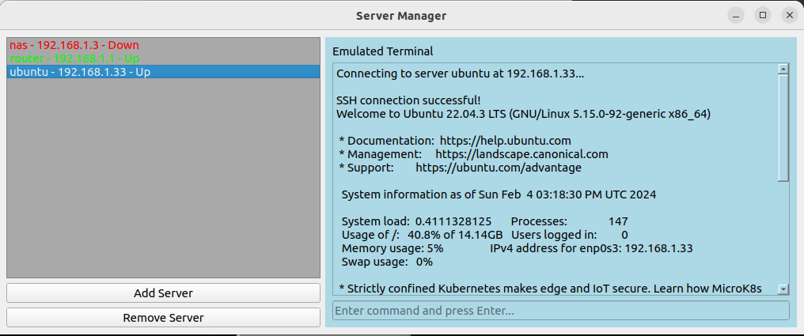

# Server-manager

Server-manager is a simple python3 tkinter interface that can be used to manage ssh to serves.<br>
to run the server manager we simply need to download the git repo:
```bash
git clone https://github.com/Disturbante/Server-manager.git
cd Server-manager
pip3 install -r requirements.txt
chmod +x Server-manager.py
./Server-manager.py
```
We can manage server and use the python script also on other server, we just need to import the `servers.json` file that would be created when we add or remove servers.<br>
This scripts is much more powerfull when we use an ssh `config` file<br>
_old tkinter interface:_


_TO DO_<br>
- [x] _Implement terminal inside the interface_
- [x] _Switch interface to pyQt_
- [x] _Implement server status_ 
- [ ] _Implement settings button_
- [ ] _Implement custom ssh port_
- [ ] _Implement upload and download functionality_
- [ ] _Implement ssh config file login_
- [ ] _Implement id_rsa login_
