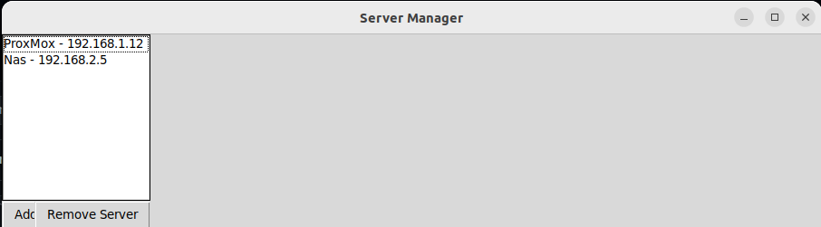

# Server-manager

Server-manager is a simple python3 tkinter interface that can be used to manage ssh to serves.<br>
to run the server manager we simply need to download the git repo:
```bash
git clone https://github.com/Disturbante/Server-manager.git
cd Server-manager
chmod +x main.py
./main.py
```
We can manage server and use the python script also on other server, we just need to import the `servers.json` file that would be created when we add or remove servers.<br>
This scripts is much more powerfull when we use an ssh `config` file



_TO DO_<br>
- []_Implement terminal inside the interface_
- []_Implement server status_ 
